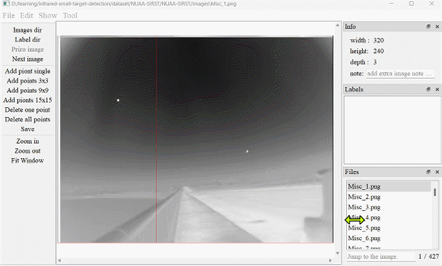

This repository shows our developed single-point annotation software. [Download dir](https://pan.baidu.com/s/126rl8KuF96W1QmR7v8GK7w?pwd=u0hn) 
It is based on our proposed algorithm MCLC published in IEEE ICCV-2023.[[Paper]](https://openaccess.thecvf.com/content/ICCV2023/papers/Li_Monte_Carlo_Linear_Clustering_with_Single-Point_Supervision_is_Enough_for_ICCV_2023_paper.pdf)

